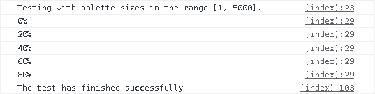

# Integration test: palette

In this integration test, a paletted \<canvas\> is filled with pixels from an *n*-sized palette.

The goal of the test is to assert the following:
- Whether a paletted \<canvas\> can successfully adopt and use an arbitrarily-sized palette.
- Whether a paletted \<canvas\> can successfully display pixels whose color data comes from an arbitrarily-sized palette.

\
*Viewing the output of a successful test run in a browser's developer console.*

## Usage

To run the test, follow these steps:

1. Host the root repo on a server (e.g. on localhost).
1. Open the developer console in your browser.
1. From the repo's root, browse to the test's [index.html](./index.html) file (so that relative paths in the file are expanded correctly).
1. Wait for the developer console to inform you that the test has been completed (or terminated, if an error occurred).
