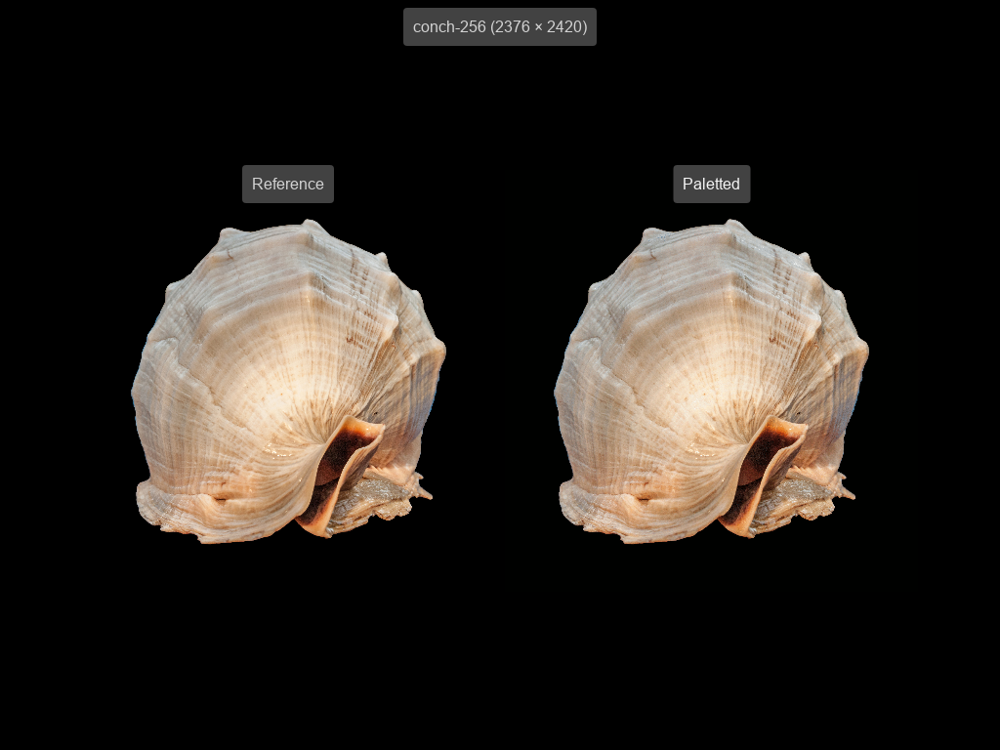

# Integration test: reference vs. paletted

In this integration test, image pairs are rendered side by side, one image in a regular canvas using 32-bit color and the other the same image but in a paletted canvas using indexed color. Some performance metrics are also printed into the browser's developer console.

The test has two goals:
- To provide a visual comparison of the output of a paletted canvas and the output of a regular canvas.
- To provide a performance comparison of per-pixel drawing into a paletted canvas and per-pixel drawing into a regular canvas.

\
*Viewing the results.*

## Usage

To run the test, follow these steps:

1. Host the root repo on a server (e.g. on localhost).
1. From the repo's root, browse to the test's [index.html](./index.html) file (so that relative paths in the file are expanded correctly).
1. Once the page has loaded, compare the rendered images by eye (e.g. to see if there are any obvious abnormalities), and view the performance data in the developer console.

### The test cases

| Case | Description |
| ---- | ----------- |
| conch-256 | Renders a 2376 &times; 2420 image using the image's full color space for the reference canvas and a 256-color palette for the paletted canvas. The paletted canvas is expected to look quite similar to the reference image, but with some hot pixels apparent when viewed in original size. |
| conch-14 | Renders a 2376 &times; 2420 image using the image's full color space for the reference canvas and a 14-color palette for the paletted canvas. The paletted canvas is expected to show a notably reduced color space relative to the reference image, but still look very similar when squinting. |
| conch-small-256 | Renders a 255 &times; 250 image using the image's full color space for the reference canvas and a 256-color palette for the paletted canvas. The pixel count of the image roughly equates to that of VGA mode 13h (320 &times; 200). |

On my system, in the conch-256 and conch-14 cases, the regular canvas is slightly faster overall, but the paletted canvas is almost three times faster in rasterization. In the conch-small-256 case, the regular canvas is about twice as fast overall, while the paletted canvas is about 50% faster in rasterization.

### Visual comparison

The test relies on you having prior knowledge &ndash; from having run it in a known good configuration &ndash; of how the images should look, so that you can spot problems. The screenshot above should also give you some indication of what to expect.

In most cases, the reference image will probably render correctly, and bugs and regressions will show up in the paletted rendering, if anywhere.

### Performance comparison

The performance metrics printed into the developer console show the time taken, in milliseconds, to perform rasterization (per-pixel drawing into the canvas's pixel buffer) and overall displaying of the image on the canvas (including the rasterization time).

Paletted rasterization can be expected to take less time than regular rasterization, because less data needs to be written per pixel. On the other hand, it takes longer to display a paletted image, because each pixel needs to first be converted from indexed color to 32-bit color.
